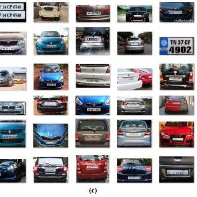
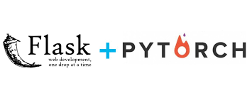

# Standford cars classfication web app deployment using Pytorch and Flask 💵💳

<p align="center">
  
</p>

## 📌 Introduction

3D object representations are valuable resources for multi-view object class detection and scene understanding. Fine-grained recognition is a growing subfield of computer vision that has many real-world applications on distinguishing subtle appearances differences. This cars dataset contains great training and testing sets for forming models that can tell cars from one another. Data originated from Stanford University AI Lab.

## 💵 Content
The Cars dataset contains 16,185 images of 196 classes of cars. The data is split into 8,144 training images and 8,041 testing images, where each class has been split roughly in a 50-50 split. Classes are typically at the level of Make, Model, Year, ex. 2012 Tesla Model S or 2012 BMW M3 coupe.
Link to the dataset [Stanford Cars Dataset](https://www.kaggle.com/datasets/jessicali9530/stanford-cars-dataset)
## 🎯 Purpose of the Project
To build a model and deploy it to the web to classify the car by manufacturer, model and year. The car classification web app technology is operated with the use of different programming languages and software such as Python, Deep-Learning, PyTorch, OpenCV, Flask and many more

## 🏁 Technology Stack

* [Python](https://python.org/)
* [Pytorch](https://pytorch.org/)
* [Flask](https://github.com/pallets/flask)
* [Numpy](https://numpy.org/)
* [Matplotlib: Visualization with Python](https://matplotlib.org/)
* [scikit-learn](https://scikit-learn.org)
* [tqdm](https://github.com/tqdm/tqdm)

## 🎯 Evaluation Metrics

```sh
                                              accuracy                           0.84      8041
                                             macro avg       0.84      0.85      0.84      8041
                                          weighted avg       0.85      0.84      0.84      8041
```

## 🏃‍♂️ Local Installation

1. Drop a ⭐ on the Github Repository. 
2. Clone the Repo by going to your local Git Client and pushing in the command: 

```sh
https://github.com/DARK-art108/Bank-Note-Authentication-End-to-End-Project-1.git
```
3. Install the Packages: 
```sh
pip install -r requirements.txt
```
You need to install flask seperatly with a latest version to run the flask app in Postman.

## 🎯 Host the web app use Flask your Application

<p align="center">
  
</p>

4. Run the flask app: 
```sh
python ./app.py
```

## 📋 Further Changes to be Done
- [ ] Containerize an application
- [ ] Deploying the Web Application on Cloud.
     - [ ] AWS BeanStalk
     - [ ] Google Cloud Platform
     - [ ] Azure
     
## 📜 LICENSE

[MIT](https://github.com/git/git-scm.com/blob/main/MIT-LICENSE.txt)
    
